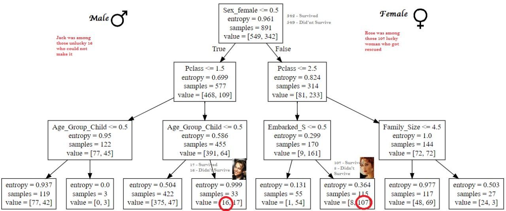

# Titanic : An Analysis using Decsion Tree ( With Family )

Two new datasets named **titanic_train** and **titanic_test** have been created using 2 respective csvs i.e. **titanic_train.csv** and **titanic_test.csv**


```python
import pandas as pd
import numpy as np
from sklearn.preprocessing import Imputer
from sklearn import tree
from sklearn import metrics
import matplotlib.pyplot as plt
%matplotlib inline

titanic_train = pd.read_csv('E:/CSVFiles/Titanic/train.csv')
titanic_test = pd.read_csv('E:/CSVFiles/Titanic/test.csv')
```


```python
titanic_train.head()
```
<table border="1" class="dataframe">
  <thead>
    <tr style="text-align: right;">
      <th></th>
      <th>PassengerId</th>
      <th>Survived</th>
      <th>Pclass</th>
      <th>Name</th>
      <th>Sex</th>
      <th>Age</th>
      <th>SibSp</th>
      <th>Parch</th>
      <th>Ticket</th>
      <th>Fare</th>
      <th>Cabin</th>
      <th>Embarked</th>
    </tr>
  </thead>
  <tbody>
    <tr>
      <th>0</th>
      <td>1</td>
      <td>0</td>
      <td>3</td>
      <td>Braund, Mr. Owen Harris</td>
      <td>male</td>
      <td>22.0</td>
      <td>1</td>
      <td>0</td>
      <td>A/5 21171</td>
      <td>7.2500</td>
      <td>NaN</td>
      <td>S</td>
    </tr>
    <tr>
      <th>1</th>
      <td>2</td>
      <td>1</td>
      <td>1</td>
      <td>Cumings, Mrs. John Bradley (Florence Briggs Th...</td>
      <td>female</td>
      <td>38.0</td>
      <td>1</td>
      <td>0</td>
      <td>PC 17599</td>
      <td>71.2833</td>
      <td>C85</td>
      <td>C</td>
    </tr>
    <tr>
      <th>2</th>
      <td>3</td>
      <td>1</td>
      <td>3</td>
      <td>Heikkinen, Miss. Laina</td>
      <td>female</td>
      <td>26.0</td>
      <td>0</td>
      <td>0</td>
      <td>STON/O2. 3101282</td>
      <td>7.9250</td>
      <td>NaN</td>
      <td>S</td>
    </tr>
    <tr>
      <th>3</th>
      <td>4</td>
      <td>1</td>
      <td>1</td>
      <td>Futrelle, Mrs. Jacques Heath (Lily May Peel)</td>
      <td>female</td>
      <td>35.0</td>
      <td>1</td>
      <td>0</td>
      <td>113803</td>
      <td>53.1000</td>
      <td>C123</td>
      <td>S</td>
    </tr>
    <tr>
      <th>4</th>
      <td>5</td>
      <td>0</td>
      <td>3</td>
      <td>Allen, Mr. William Henry</td>
      <td>male</td>
      <td>35.0</td>
      <td>0</td>
      <td>0</td>
      <td>373450</td>
      <td>8.0500</td>
      <td>NaN</td>
      <td>S</td>
    </tr>
  </tbody>
</table>
</div>

Calculating the **percentage of null values** in the **missing_data** dataframe. 

```python
total = titanic_train.isnull().sum().sort_values(ascending=False)
percent = (titanic_train.isnull().sum()/titanic_train.isnull().count()).sort_values(ascending=False)
missing_data = pd.concat([total, percent], axis=1, keys=['Total', 'Percent'])
missing_data.head(20)
```

<table border="1" class="dataframe">
  <thead>
    <tr style="text-align: right;">
      <th></th>
      <th>Total</th>
      <th>Percent</th>
    </tr>
  </thead>
  <tbody>
    <tr>
      <th>Cabin</th>
      <td>687</td>
      <td>0.771044</td>
    </tr>
    <tr>
      <th>Age</th>
      <td>177</td>
      <td>0.198653</td>
    </tr>
    <tr>
      <th>Embarked</th>
      <td>2</td>
      <td>0.002245</td>
    </tr>
    <tr>
      <th>Fare</th>
      <td>0</td>
      <td>0.000000</td>
    </tr>
    <tr>
      <th>Ticket</th>
      <td>0</td>
      <td>0.000000</td>
    </tr>
    <tr>
      <th>Parch</th>
      <td>0</td>
      <td>0.000000</td>
    </tr>
    <tr>
      <th>SibSp</th>
      <td>0</td>
      <td>0.000000</td>
    </tr>
    <tr>
      <th>Sex</th>
      <td>0</td>
      <td>0.000000</td>
    </tr>
    <tr>
      <th>Name</th>
      <td>0</td>
      <td>0.000000</td>
    </tr>
    <tr>
      <th>Pclass</th>
      <td>0</td>
      <td>0.000000</td>
    </tr>
    <tr>
      <th>Survived</th>
      <td>0</td>
      <td>0.000000</td>
    </tr>
    <tr>
      <th>PassengerId</th>
      <td>0</td>
      <td>0.000000</td>
    </tr>
  </tbody>
</table>
</div>


It is seen that number of **Null** Values are **177** for **Age** and **687** for **Cabin** column 

```python
titanic_train.isnull().sum()

    PassengerId      0
    Survived         0
    Pclass           0
    Name             0
    Sex              0
    Age            177
    SibSp            0
    Parch            0
    Ticket           0
    Fare             0
    Cabin          687
    Embarked         2
    dtype: int64
```


```python
titanic_train.columns[pd.isnull(titanic_train).sum() > 0].tolist()
    ['Age', 'Cabin', 'Embarked']
```

Creating a new column **Family_Size** for the data set **titanic_train**

```python
titanic_train['Family_Size'] = titanic_train['SibSp'] + titanic_train['Parch'] + 1
```
Dropping the corresponding columns **Name**, **Cabin**, and **Ticket** from the dataframe **titanic_train**

```
titanic_train.drop('Name',axis=1,inplace=True)
titanic_train.drop('Cabin',axis=1,inplace=True)
titanic_train.drop('Ticket',axis=1,inplace=True)
```
The mean value of age is 29.69 years. So we will plan to replace those **NaN** values against column **Age** with **29**

```python
titanic_train['Age'].mean()
    29.69911764705882
```
Replacing the missing value of column **Age** with the value **29** years.

```python
titanic_train['Age'].fillna(value=29, inplace=True)
```


```python
titanic_train.head()
```

<table border="1" class="dataframe">
  <thead>
    <tr style="text-align: right;">
      <th></th>
      <th>PassengerId</th>
      <th>Survived</th>
      <th>Pclass</th>
      <th>Sex</th>
      <th>Age</th>
      <th>SibSp</th>
      <th>Parch</th>
      <th>Fare</th>
      <th>Embarked</th>
      <th>Family_Size</th>
    </tr>
  </thead>
  <tbody>
    <tr>
      <th>0</th>
      <td>1</td>
      <td>0</td>
      <td>3</td>
      <td>male</td>
      <td>22.0</td>
      <td>1</td>
      <td>0</td>
      <td>7.2500</td>
      <td>S</td>
      <td>2</td>
    </tr>
    <tr>
      <th>1</th>
      <td>2</td>
      <td>1</td>
      <td>1</td>
      <td>female</td>
      <td>38.0</td>
      <td>1</td>
      <td>0</td>
      <td>71.2833</td>
      <td>C</td>
      <td>2</td>
    </tr>
    <tr>
      <th>2</th>
      <td>3</td>
      <td>1</td>
      <td>3</td>
      <td>female</td>
      <td>26.0</td>
      <td>0</td>
      <td>0</td>
      <td>7.9250</td>
      <td>S</td>
      <td>1</td>
    </tr>
    <tr>
      <th>3</th>
      <td>4</td>
      <td>1</td>
      <td>1</td>
      <td>female</td>
      <td>35.0</td>
      <td>1</td>
      <td>0</td>
      <td>53.1000</td>
      <td>S</td>
      <td>2</td>
    </tr>
    <tr>
      <th>4</th>
      <td>5</td>
      <td>0</td>
      <td>3</td>
      <td>male</td>
      <td>35.0</td>
      <td>0</td>
      <td>0</td>
      <td>8.0500</td>
      <td>S</td>
      <td>1</td>
    </tr>
  </tbody>
</table>
</div>


A new function has been created called **Age_To_Groups** which will segragate the values of age into 5 main categories i.e.

1) **Age < 12 --> Child**
2) **12 < Age < 19 --> Tenager**
3) **19 < Age < 30 --> Youth**
4) **30 < Age < 50 --> Middle_Aged**
5) **50 < Age < 100 --> Senior_Citizen**


```python
def Age_To_Groups(age):

    if age < 12:
        return 'Child'
    elif 12 < age < 19:
        return 'Tenager'
    elif 19 < age < 30:
        return 'Youth'
    elif 30 < age < 50:
        return 'Middle_Aged'
    elif 50 < age < 100:
        return 'Senior_Citizen'
```

The function **Age_To_Groups** has been applied to the **Age** column in order to convert them into categorical values.

```python
titanic_train['Age_Group'] = titanic_train['Age'].apply(Age_To_Groups)
```

```python
titanic_train['Age_Group'].value_counts()

    Youth             397
    Middle_Aged       231
    Tenager            70
    Child              68
    Senior_Citizen     64
    Name: Age_Group, dtype: int64
```
After this all the categorical values been converted into dummy variables using **get_dummies** of titanic_train dataset

```python
titanic_train = pd.get_dummies(titanic_train)
```
Below is the dataset after the conversion

```python
titanic_train.head()
```
<table border="1" class="dataframe">
  <thead>
    <tr style="text-align: right;">
      <th></th>
      <th>PassengerId</th>
      <th>Survived</th>
      <th>Pclass</th>
      <th>Age</th>
      <th>SibSp</th>
      <th>Parch</th>
      <th>Fare</th>
      <th>Family_Size</th>
      <th>Sex_female</th>
      <th>Sex_male</th>
      <th>Embarked_C</th>
      <th>Embarked_Q</th>
      <th>Embarked_S</th>
      <th>Age_Group_Child</th>
      <th>Age_Group_Middle_Aged</th>
      <th>Age_Group_Senior_Citizen</th>
      <th>Age_Group_Tenager</th>
      <th>Age_Group_Youth</th>
    </tr>
  </thead>
  <tbody>
    <tr>
      <th>0</th>
      <td>1</td>
      <td>0</td>
      <td>3</td>
      <td>22.0</td>
      <td>1</td>
      <td>0</td>
      <td>7.2500</td>
      <td>2</td>
      <td>0</td>
      <td>1</td>
      <td>0</td>
      <td>0</td>
      <td>1</td>
      <td>0</td>
      <td>0</td>
      <td>0</td>
      <td>0</td>
      <td>1</td>
    </tr>
    <tr>
      <th>1</th>
      <td>2</td>
      <td>1</td>
      <td>1</td>
      <td>38.0</td>
      <td>1</td>
      <td>0</td>
      <td>71.2833</td>
      <td>2</td>
      <td>1</td>
      <td>0</td>
      <td>1</td>
      <td>0</td>
      <td>0</td>
      <td>0</td>
      <td>1</td>
      <td>0</td>
      <td>0</td>
      <td>0</td>
    </tr>
    <tr>
      <th>2</th>
      <td>3</td>
      <td>1</td>
      <td>3</td>
      <td>26.0</td>
      <td>0</td>
      <td>0</td>
      <td>7.9250</td>
      <td>1</td>
      <td>1</td>
      <td>0</td>
      <td>0</td>
      <td>0</td>
      <td>1</td>
      <td>0</td>
      <td>0</td>
      <td>0</td>
      <td>0</td>
      <td>1</td>
    </tr>
    <tr>
      <th>3</th>
      <td>4</td>
      <td>1</td>
      <td>1</td>
      <td>35.0</td>
      <td>1</td>
      <td>0</td>
      <td>53.1000</td>
      <td>2</td>
      <td>1</td>
      <td>0</td>
      <td>0</td>
      <td>0</td>
      <td>1</td>
      <td>0</td>
      <td>1</td>
      <td>0</td>
      <td>0</td>
      <td>0</td>
    </tr>
    <tr>
      <th>4</th>
      <td>5</td>
      <td>0</td>
      <td>3</td>
      <td>35.0</td>
      <td>0</td>
      <td>0</td>
      <td>8.0500</td>
      <td>1</td>
      <td>0</td>
      <td>1</td>
      <td>0</td>
      <td>0</td>
      <td>1</td>
      <td>0</td>
      <td>1</td>
      <td>0</td>
      <td>0</td>
      <td>0</td>
    </tr>
  </tbody>
</table>
</div>


Also we can see that there is no **NaN** values in the training dataset.

```python
titanic_train.isnull().sum()

    PassengerId                 0
    Survived                    0
    Pclass                      0
    Age                         0
    SibSp                       0
    Parch                       0
    Fare                        0
    Family_Size                 0
    Sex_female                  0
    Sex_male                    0
    Embarked_C                  0
    Embarked_Q                  0
    Embarked_S                  0
    Age_Group_Child             0
    Age_Group_Middle_Aged       0
    Age_Group_Senior_Citizen    0
    Age_Group_Tenager           0
    Age_Group_Youth             0
    dtype: int64
```

Dataset has been converted into X and Y arrays of features.

```python
Y = targets = labels = titanic_train['Survived'].values

columns = ["Fare","Pclass","Sex_female","Sex_male","Embarked_C","Embarked_Q","Embarked_S", "SibSp", "Parch","Family_Size","Age_Group_Child","Age_Group_Middle_Aged","Age_Group_Senior_Citizen","Age_Group_Tenager","Age_Group_Youth"]
features = titanic_train[list(columns)].values
features
    array([[ 7.25  ,  3.    ,  0.    , ...,  0.    ,  0.    ,  1.    ],
           [71.2833,  1.    ,  1.    , ...,  0.    ,  0.    ,  0.    ],
           [ 7.925 ,  3.    ,  1.    , ...,  0.    ,  0.    ,  1.    ],
           ...,
           [23.45  ,  3.    ,  1.    , ...,  0.    ,  0.    ,  1.    ],
           [30.    ,  1.    ,  0.    , ...,  0.    ,  0.    ,  1.    ],
           [ 7.75  ,  3.    ,  0.    , ...,  0.    ,  0.    ,  0.    ]])

X = features
X
    array([[ 7.25  ,  3.    ,  0.    , ...,  0.    ,  0.    ,  1.    ],
           [71.2833,  1.    ,  1.    , ...,  0.    ,  0.    ,  0.    ],
           [ 7.925 ,  3.    ,  1.    , ...,  0.    ,  0.    ,  1.    ],
           ...,
           [23.45  ,  3.    ,  1.    , ...,  0.    ,  0.    ,  1.    ],
           [30.    ,  1.    ,  0.    , ...,  0.    ,  0.    ,  1.    ],
           [ 7.75  ,  3.    ,  0.    , ...,  0.    ,  0.    ,  0.    ]])

```

Decision Tree classifier has been used inorder to implement the **decision tree** algorithm on **X and Y** 

```python
my_tree_one = tree.DecisionTreeClassifier(criterion="entropy", max_depth=3)
my_tree_one = my_tree_one.fit(X,Y)
my_tree_one

    DecisionTreeClassifier(class_weight=None, criterion='entropy', max_depth=3,
                max_features=None, max_leaf_nodes=None,
                min_impurity_decrease=0.0, min_impurity_split=None,
                min_samples_leaf=1, min_samples_split=2,
                min_weight_fraction_leaf=0.0, presort=False, random_state=None,
                splitter='best')
```
Importance of the feature has been identfied using **feature_importance**

```python
print(my_tree_one.feature_importances_)
print(my_tree_one.score(X,Y))
list(zip(columns,my_tree_one.feature_importances_))

    [0.07618531 0.1868736  0.         0.5677067  0.         0.
     0.         0.         0.         0.08384035 0.08539404 0.
     0.         0.         0.        ]
    0.8215488215488216

    [('Fare', 0.07618531188617528),
     ('Pclass', 0.18687359962400962),
     ('Sex_female', 0.0),
     ('Sex_male', 0.5677067003586163),
     ('Embarked_C', 0.0),
     ('Embarked_Q', 0.0),
     ('Embarked_S', 0.0),
     ('SibSp', 0.0),
     ('Parch', 0.0),
     ('Family_Size', 0.08384034573912937),
     ('Age_Group_Child', 0.08539404239206941),
     ('Age_Group_Middle_Aged', 0.0),
     ('Age_Group_Senior_Citizen', 0.0),
     ('Age_Group_Tenager', 0.0),
     ('Age_Group_Youth', 0.0)]
```
Since Fare and Pclass are both related to each other and the feature importance of **Pclass** is more than **Fare** hence Fare is removed

```python

columns = ["Pclass","Sex_female","Sex_male","Embarked_C","Embarked_Q","Embarked_S", "SibSp", "Parch","Family_Size","Age_Group_Child","Age_Group_Middle_Aged","Age_Group_Senior_Citizen","Age_Group_Tenager","Age_Group_Youth"]
features = titanic_train[list(columns)].values
features

    array([[3, 0, 1, ..., 0, 0, 1],
           [1, 1, 0, ..., 0, 0, 0],
           [3, 1, 0, ..., 0, 0, 1],
           ...,
           [3, 1, 0, ..., 0, 0, 1],
           [1, 0, 1, ..., 0, 0, 1],
           [3, 0, 1, ..., 0, 0, 0]], dtype=int64)

X_nofare = features
X_nofare

    array([[3, 0, 1, ..., 0, 0, 1],
           [1, 1, 0, ..., 0, 0, 0],
           [3, 1, 0, ..., 0, 0, 1],
           ...,
           [3, 1, 0, ..., 0, 0, 1],
           [1, 0, 1, ..., 0, 0, 1],
           [3, 0, 1, ..., 0, 0, 0]], dtype=int64)
```

Decision Tree Classifier has been used once again

```python
my_tree_one_nofare = tree.DecisionTreeClassifier(criterion="entropy", max_depth=3)
my_tree_one_nofare = my_tree_one.fit(X_nofare,Y)
my_tree_one_nofare

    DecisionTreeClassifier(class_weight=None, criterion='entropy', max_depth=3,
                max_features=None, max_leaf_nodes=None,
                min_impurity_decrease=0.0, min_impurity_split=None,
                min_samples_leaf=1, min_samples_split=2,
                min_weight_fraction_leaf=0.0, presort=False, random_state=None,
                splitter='best')

print(my_tree_one_nofare.feature_importances_)
print(my_tree_one_nofare.score(X_nofare,Y))
list(zip(columns,my_tree_one_nofare.feature_importances_))

    [0.26338546 0.60250474 0.         0.         0.         0.00523258
     0.         0.         0.0501605  0.07871672 0.         0.
     0.         0.        ]
    0.8148148148148148

    [('Pclass', 0.2633854609255124),
     ('Sex_female', 0.6025047440218411),
     ('Sex_male', 0.0),
     ('Embarked_C', 0.0),
     ('Embarked_Q', 0.0),
     ('Embarked_S', 0.005232575039177103),
     ('SibSp', 0.0),
     ('Parch', 0.0),
     ('Family_Size', 0.05016050410292612),
     ('Age_Group_Child', 0.07871671591054341),
     ('Age_Group_Middle_Aged', 0.0),
     ('Age_Group_Senior_Citizen', 0.0),
     ('Age_Group_Tenager', 0.0),
     ('Age_Group_Youth', 0.0)]
```

After removing the feature **Fare** it is found that the feature **Sex_female** has got highest importance while the other features in decreasing order would be **Pclass**, **Age_Group_Child**, and **Embarked_S**

In order to visualize the decision tree we took the help of *http://www.webgraphviz.com/*
Below is the python code been used inorder to produce the graphviz data in doc format.

```python
with open("titanic.dot", 'w') as f:
    f = tree.export_graphviz(my_tree_one, out_file=f, feature_names=columns)
```


After going through the above diagram it can be concluded that: 

1) **Kate** belonged to those lucky **107 females** who **embarked from Southampton** and **belonged to 1st or 2nd Class**. As per the movie Kate also belonged to *1st Classs* and embarked from *Southampton*

2) On the other hand, **Jack** belonged to those illfated **16 males** who were either from **2nd or 3rd** class. As per the movie **Jack** belonged to **3rd class**
