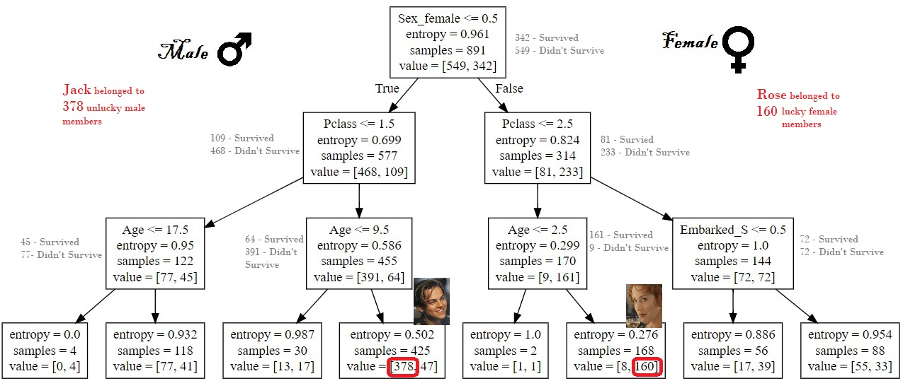

## Titanic : An Analysis using Decsion Tree ( Wihtout Family )  ##

Two new datasets named **titanic_train** and **titanic_test** have been created using 2 respective csvs i.e. **titanic_train.csv** and **titanic_test.csv**


```python
import pandas as pd
import numpy as np
from sklearn.preprocessing import Imputer
from sklearn import tree
from sklearn import metrics
import matplotlib.pyplot as plt
%matplotlib inline

titanic_train = pd.read_csv('C:/Users/SaikatPC/Desktop/CSVFiles/titanic_train.csv')
titanic_test = pd.read_csv('C:/Users/SaikatPC/Desktop/CSVFiles/titanic_test.csv')
```

Columns **Name**, **Cabin**, and **Ticket** have been dropped from the **titanic_train** dataset and categorical values have been convereted into dummy variables as mentioned below.

```python
titanic_train_name = titanic_train['Name']
titanic_train.drop('Name',axis=1,inplace=True)
titanic_train.drop('Cabin',axis=1,inplace=True)
titanic_train.drop('Ticket',axis=1,inplace=True)

titanic_train = pd.get_dummies(titanic_train)
titanic_train.head(10)
```

<table border="1" class="dataframe">
  <thead>
    <tr style="text-align: right;">
      <th></th>
      <th>PassengerId</th>
      <th>Survived</th>
      <th>Pclass</th>
      <th>Age</th>
      <th>SibSp</th>
      <th>Parch</th>
      <th>Fare</th>
      <th>Sex_female</th>
      <th>Sex_male</th>
      <th>Embarked_C</th>
      <th>Embarked_Q</th>
      <th>Embarked_S</th>
    </tr>
  </thead>
  <tbody>
    <tr>
      <th>0</th>
      <td>1</td>
      <td>0</td>
      <td>3</td>
      <td>22.0</td>
      <td>1</td>
      <td>0</td>
      <td>7.2500</td>
      <td>0</td>
      <td>1</td>
      <td>0</td>
      <td>0</td>
      <td>1</td>
    </tr>
    <tr>
      <th>1</th>
      <td>2</td>
      <td>1</td>
      <td>1</td>
      <td>38.0</td>
      <td>1</td>
      <td>0</td>
      <td>71.2833</td>
      <td>1</td>
      <td>0</td>
      <td>1</td>
      <td>0</td>
      <td>0</td>
    </tr>
    <tr>
      <th>2</th>
      <td>3</td>
      <td>1</td>
      <td>3</td>
      <td>26.0</td>
      <td>0</td>
      <td>0</td>
      <td>7.9250</td>
      <td>1</td>
      <td>0</td>
      <td>0</td>
      <td>0</td>
      <td>1</td>
    </tr>
    <tr>
      <th>3</th>
      <td>4</td>
      <td>1</td>
      <td>1</td>
      <td>35.0</td>
      <td>1</td>
      <td>0</td>
      <td>53.1000</td>
      <td>1</td>
      <td>0</td>
      <td>0</td>
      <td>0</td>
      <td>1</td>
    </tr>
    <tr>
      <th>4</th>
      <td>5</td>
      <td>0</td>
      <td>3</td>
      <td>35.0</td>
      <td>0</td>
      <td>0</td>
      <td>8.0500</td>
      <td>0</td>
      <td>1</td>
      <td>0</td>
      <td>0</td>
      <td>1</td>
    </tr>
    <tr>
      <th>5</th>
      <td>6</td>
      <td>0</td>
      <td>3</td>
      <td>NaN</td>
      <td>0</td>
      <td>0</td>
      <td>8.4583</td>
      <td>0</td>
      <td>1</td>
      <td>0</td>
      <td>1</td>
      <td>0</td>
    </tr>
    <tr>
      <th>6</th>
      <td>7</td>
      <td>0</td>
      <td>1</td>
      <td>54.0</td>
      <td>0</td>
      <td>0</td>
      <td>51.8625</td>
      <td>0</td>
      <td>1</td>
      <td>0</td>
      <td>0</td>
      <td>1</td>
    </tr>
    <tr>
      <th>7</th>
      <td>8</td>
      <td>0</td>
      <td>3</td>
      <td>2.0</td>
      <td>3</td>
      <td>1</td>
      <td>21.0750</td>
      <td>0</td>
      <td>1</td>
      <td>0</td>
      <td>0</td>
      <td>1</td>
    </tr>
    <tr>
      <th>8</th>
      <td>9</td>
      <td>1</td>
      <td>3</td>
      <td>27.0</td>
      <td>0</td>
      <td>2</td>
      <td>11.1333</td>
      <td>1</td>
      <td>0</td>
      <td>0</td>
      <td>0</td>
      <td>1</td>
    </tr>
    <tr>
      <th>9</th>
      <td>10</td>
      <td>1</td>
      <td>2</td>
      <td>14.0</td>
      <td>1</td>
      <td>0</td>
      <td>30.0708</td>
      <td>1</td>
      <td>0</td>
      <td>1</td>
      <td>0</td>
      <td>0</td>
    </tr>
  </tbody>
</table>
</div>


The total number of rows in the **titanic_train** dataset is **891** and number of columns including **Survived** is 12.

```python
titanic_train.shape

    (891, 12)
```

Now, **titanic_train** dataset has been splited into 2 arrays i.e. **X and Y** where dataset **X** is consiting of below 11 features and **Y** is consisting of column **Survived**

```python
Y = targets = labels = titanic_train['Survived'].values
columns = ["Fare","Pclass","Sex_female","Sex_male","Embarked_C","Embarked_Q","Embarked_S", "Age", "SibSp", "Parch"]
features = titanic_train[list(columns)].values
features

    array([[ 7.25  ,  3.    ,  0.    , ..., 22.    ,  1.    ,  0.    ],
           [71.2833,  1.    ,  1.    , ..., 38.    ,  1.    ,  0.    ],
           [ 7.925 ,  3.    ,  1.    , ..., 26.    ,  0.    ,  0.    ],
           ...,
           [23.45  ,  3.    ,  1.    , ...,     nan,  1.    ,  2.    ],
           [30.    ,  1.    ,  0.    , ..., 26.    ,  0.    ,  0.    ],
           [ 7.75  ,  3.    ,  0.    , ..., 32.    ,  0.    ,  0.    ]])

```
Feature **Age** has **NaN** values and which is why **Imputer** function has been used in ordere to replace those **NaN** value with the mean value of **Age** column.

```python
imp = Imputer(missing_values='NaN', strategy='mean', axis=0)
X = imp.fit_transform(features)
X

    array([[ 7.25      ,  3.        ,  0.        , ..., 22.        ,
             1.        ,  0.        ],
           [71.2833    ,  1.        ,  1.        , ..., 38.        ,
             1.        ,  0.        ],
           [ 7.925     ,  3.        ,  1.        , ..., 26.        ,
             0.        ,  0.        ],
           ...,
           [23.45      ,  3.        ,  1.        , ..., 29.69911765,
             1.        ,  2.        ],
           [30.        ,  1.        ,  0.        , ..., 26.        ,
             0.        ,  0.        ],
           [ 7.75      ,  3.        ,  0.        , ..., 32.        ,
             0.        ,  0.        ]])
```
Using decision tree claissifier *decision tree* algorithm has been implemented on X and Y and the feature importance has been estimaated.

```python
my_tree_one = tree.DecisionTreeClassifier(criterion="entropy", max_depth=3)
my_tree_one = my_tree_one.fit(X,Y)
my_tree_one

print(my_tree_one.feature_importances_)
print(my_tree_one.score(X,Y))
list(zip(columns,my_tree_one.feature_importances_))


    [0.12330431 0.18665493 0.5670424  0.         0.         0.
     0.         0.09423074 0.02876762 0.        ]
    0.8226711560044894
    

    [('Fare', 0.1233043102754121),
     ('Pclass', 0.18665492885980678),
     ('Sex_female', 0.5670423964748134),
     ('Sex_male', 0.0),
     ('Embarked_C', 0.0),
     ('Embarked_Q', 0.0),
     ('Embarked_S', 0.0),
     ('Age', 0.09423074090932518),
     ('SibSp', 0.02876762348064268),
     ('Parch', 0.0)]
```
From the above output of the code we can see that the feature **Sex_female** has high weaightage as compared to other features. On the other hand, we can see the importance of other features are appearing in descending order i.e. **Pclass**, **Pclass**, **Age**,and **SibSp**. 

Now, if we will look deeper, we will see that features **Fare** and **Pclass** are correlated.Its quite ovbious that we are going to have a higher **Pclass** if we can afford to pay highers **Fare**.

In order to remove the interdependency, we removed the **Fare** column from the features and tried to figure out the importance of the other features.  

# Removing Fare Column #

```python

Y = targets = labels = titanic_train['Survived'].values
columns = ["Pclass","Sex_female","Sex_male","Embarked_C","Embarked_Q","Embarked_S", "Age", "SibSp", "Parch"]
features = titanic_train[list(columns)].values
features


    array([[ 3.,  0.,  1., ..., 22.,  1.,  0.],
           [ 1.,  1.,  0., ..., 38.,  1.,  0.],
           [ 3.,  1.,  0., ..., 26.,  0.,  0.],
           ...,
           [ 3.,  1.,  0., ..., nan,  1.,  2.],
           [ 1.,  0.,  1., ..., 26.,  0.,  0.],
           [ 3.,  0.,  1., ..., 32.,  0.,  0.]])

```

Using **Imputer** we can replace the **NaN** value with the average of the **Age** feature.

```python
imp = Imputer(missing_values='NaN', strategy='mean', axis=0)
X_nofare = imp.fit_transform(features)
X_nofare
```


    array([[ 3.        ,  0.        ,  1.        , ..., 22.        ,
             1.        ,  0.        ],
           [ 1.        ,  1.        ,  0.        , ..., 38.        ,
             1.        ,  0.        ],
           [ 3.        ,  1.        ,  0.        , ..., 26.        ,
             0.        ,  0.        ],
           ...,
           [ 3.        ,  1.        ,  0.        , ..., 29.69911765,
             1.        ,  2.        ],
           [ 1.        ,  0.        ,  1.        , ..., 26.        ,
             0.        ,  0.        ],
           [ 3.        ,  0.        ,  1.        , ..., 32.        ,
             0.        ,  0.        ]])


```python
my_tree_one_nofare = tree.DecisionTreeClassifier(criterion="entropy", max_depth=3)
my_tree_one_nofare = my_tree_one_nofare.fit(X_nofare,Y)
my_tree_one_nofare

print(my_tree_one_nofare.feature_importances_)
print(my_tree_one_nofare.score(X_nofare,Y))
list(zip(columns,my_tree_one_nofare.feature_importances_))


    [0.26392436 0.60373749 0.         0.         0.         0.03242434
     0.09991381 0.         0.        ]
    0.8204264870931538
    

    [('Pclass', 0.2639243580124819),
     ('Sex_female', 0.6037374925961083),
     ('Sex_male', 0.0),
     ('Embarked_C', 0.0),
     ('Embarked_Q', 0.0),
     ('Embarked_S', 0.0324243429241766),
     ('Age', 0.09991380646723327),
     ('SibSp', 0.0),
     ('Parch', 0.0)]

```

From the above output we can identify that after removing **Fare** column the importance of the feature **Sex_female** has got increased. 

So it can be inferred that the guards in the titanic were giving more importance to the **female** at the time of rescue operation. AS per the movie "Titanic" directed by James Cameron clearly that was the case.   

```python
with open("titanic_withoutfamily.dot", 'w') as f:
    f = tree.export_graphviz(my_tree_one_nofare, out_file=f, feature_names=columns)
```

Below is the pictorial representation of the decision tree when we are eliminating **Fare** from the cocnsideration. 




After analyzing the decision tree it can be conlucded that **Jack** was among those **unlucky 378 male** who could not make it happen and **Rose** belonged to those **lucky 160** who did manage to survive. But still they **Jack** and **Rose** met as per the movie. Such is the irony of destiny and which is why **Jack** and **Rose** became a household name for the romance lovers.
